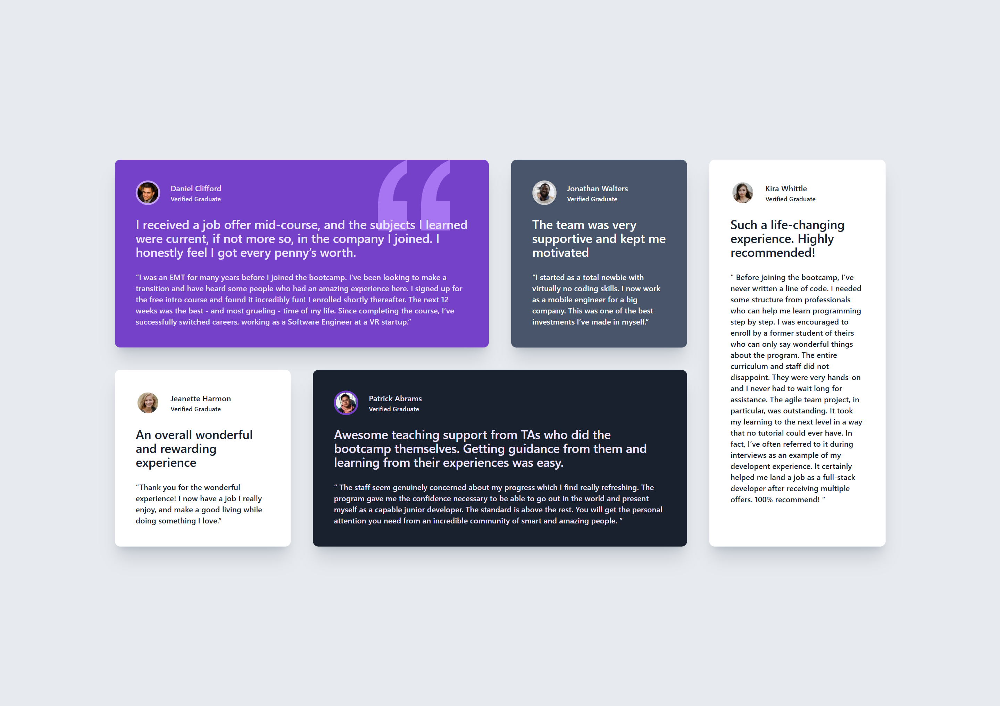
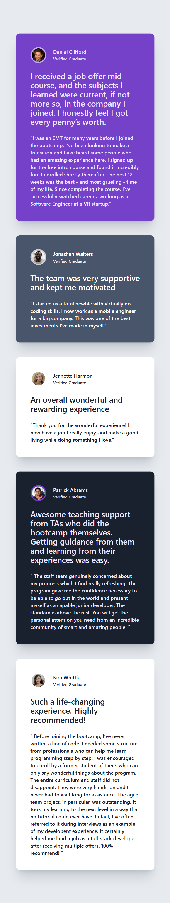

# Frontend Mentor - Testimonials grid section solution

This is a solution to the [Testimonials grid section challenge on Frontend Mentor](https://www.frontendmentor.io/challenges/testimonials-grid-section-Nnw6J7Un7). Frontend Mentor challenges help you improve your coding skills by building realistic projects. 

## Table of contents

- [Overview](#overview)
  - [The challenge](#the-challenge)
  - [Screenshot](#screenshot)
  - [Links](#links)
- [My process](#my-process)
  - [Built with](#built-with)
  - [What I Learned](#what-i-learned)
  - [Continued Development](#continued-development)
- [Author](#author)

## Overview

### The challenge

Users should be able to:

- View the optimal layout for the site depending on their device's screen size

### Screenshot

### Links

- Live Site URL: [Vercel](https://testimonial-section-with-grid.vercel.app/)

## My process

### Built with

- Semantic HTML5 markup
- CSS Grid
- Mobile-first workflow
- [Tailwind](https://tailwindcss.com/) - CSS library

### What I Learned

This project deepened my understanding of responsive layouts using Tailwind CSS, and CSS Grid.
Key Learning:

- Use of Order: I learned to reorder elements within the grid in order to maintain a uniform look in change of screens. Different order method was used in the md screen (tablet devices) and xl screens (desktop devices). 
for example, in the tablet screens the order is 'Daniel - Partick - Johnathan - Jeannette - Kira', while for the Desktop screens the order is 'Daniel - Johnathan - Kira - Jeannette - Partick'.

- Mobile-first Workflow: In this project, I focused on coding the mobile view first then worked up to the desktop view. This made the grid flow easier to achieve, and made breakpoint easier to code.

### Continued Development

In future Projects, I want to focus on the use of themes and Auto responsiveness within Tailwind

- Themes: There were 3 to 4 divs within this code that had similar design class, this made the code repeatitive and slightly messy. However with themes, I would able to create customized classes that would be reuseable.

- Auto responsiveness: The will ensure that text and images scale in respect to the screen size without extra class coding or input.

## Author

- Website - [Olorunbunmi Olajumoke](https://portfolio-eosin-two-66.vercel.app/)
- Frontend Mentor - [@codesigner-jmk](https://www.frontendmentor.io/profile/codesigner-jmk)
- Twitter - [@codesigner_jmk](https://x.com/codesigner_jmk)

